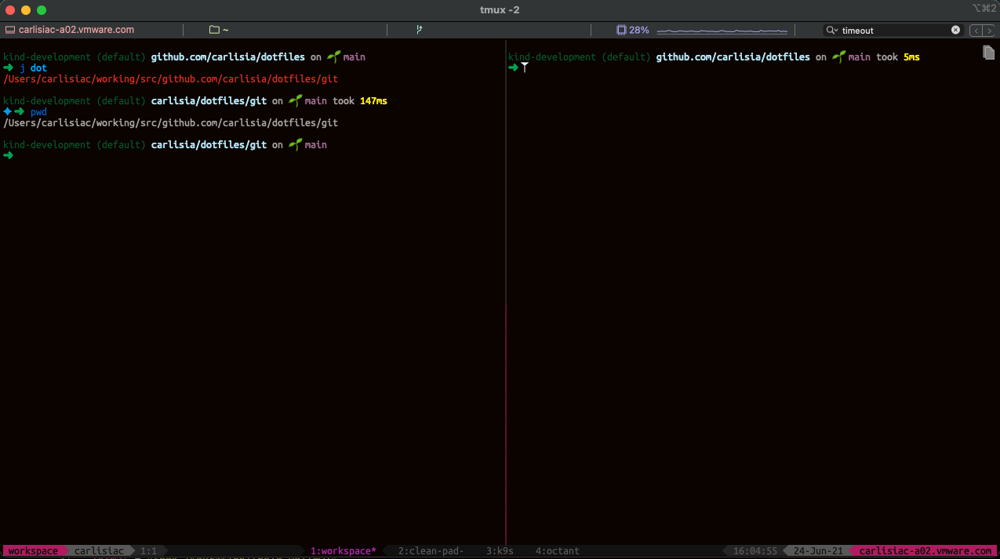
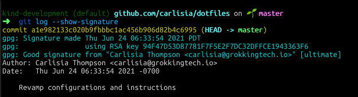
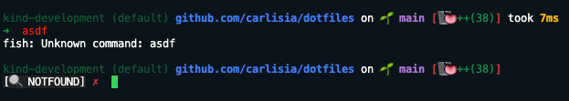
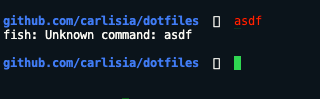
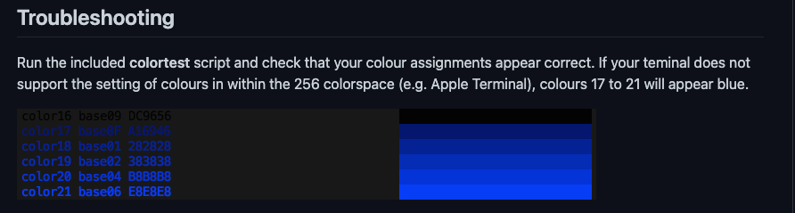
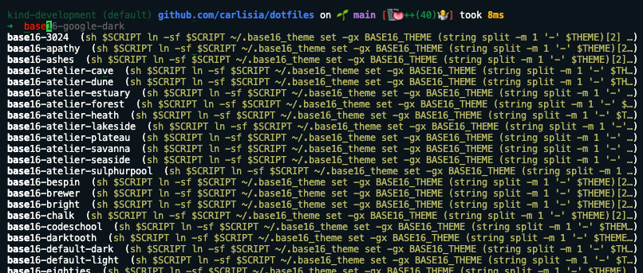
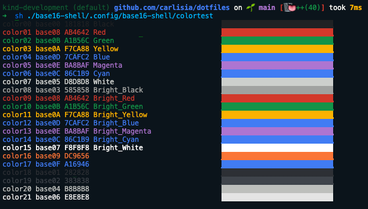

<!-- vscode-markdown-toc -->
* 1. [Terminal windows](#Terminalwindows)
	* 1.1. [Consistency across different terminals](#Consistencyacrossdifferentterminals)
	* 1.2. [Quickly change appearance](#Quicklychangeappearance)
* 2. [Git configured to sign commits automatically](#Gitconfiguredtosigncommitsautomatically)
	* 2.1. [What it looks like](#Whatitlookslike)
	* 2.2. [Configuring Git](#ConfiguringGit)
	* 2.3. [Setting up the GPG key](#SettinguptheGPGkey)
* 3. [Tool settings](#Toolsettings)
	* 3.1. [VS Code](#VSCode)
	* 3.2. [Other configs](#Otherconfigs)
* 4. [‼️ Warning about Go modules and workspaces](#WarningaboutGomodulesandworkspaces)
* 5. [Stow for environment and package configuration management](#Stowforenvironmentandpackageconfigurationmanagement)
* 6. [Installing packages](#Installingpackages)
	* 6.1. [Git](#Git)
	* 6.2. [Fish shell](#Fishshell)
		* 6.2.1. [Dependencies](#Dependencies)
	* 6.3. [Starship](#Starship)
	* 6.4. [Base16-shell](#Base16-shell)
	* 6.5. [Tmux](#Tmux)
	* 6.6. [Neovim with vim-go](#Neovimwithvim-go)
	* 6.7. [Others](#Others)

<!-- vscode-markdown-toc-config
	numbering=true
	autoSave=true
	/vscode-markdown-toc-config -->
<!-- /vscode-markdown-toc -->
# dotfiles
This is the home for my environment configurations, scripts, and exported tool settings. Some configurations are MacOS specific. For instructions on how to install and use any of these configurations, please see the [installing packages](#Installingpackages) section.

In this README I'll highlight some interesting configuration options.

##  1. <a name='Terminalwindows'></a>Terminal windows
###  1.1. <a name='Consistencyacrossdifferentterminals'></a>Consistency across different terminals
My terminal configurations allow for consistency of look and feel and of functionalities across all terminals on a MacOS, either iTerm, Terminal, or VS Code's terminal. Same whether running on `tmux` or on a straight `fish` shell.



Note at the bottom the different windows in this workspace. This is likely to change as I work with different types of projects, but this setup flexibility with tmux allows for me to work with only one terminal window most of the time. This is a setup that I run on my terminal but not on VS Code.

###  1.2. <a name='Quicklychangeappearance'></a>Quickly change appearance
No more fussing and googling around for different themes or plugins. The packages below come with easy ways to configure appearance settings. This is extra great when wanting to switch from daily work with all the information on the shell and maybe a dark mode, into a minimalist looking, light background shell for a demo/presentation.

    - starship:  many options of shell prompt styles (any shell)
    - base16-shell: many options to quickly change the shell default colors (any shell)
    - tmux
        - tmux themepack plugin: various tmux themes and statusbar styles

Changes to the configuration of any of these packages will apply to all terminal applications (some after restart.) See the [installing packages](#Installingpackages) section for instructions.

##  2. <a name='Gitconfiguredtosigncommitsautomatically'></a>Git configured to sign commits automatically
This configuration allows the signing of commits automatically, and without having to append the `-s` flag every time.

###  2.1. <a name='Whatitlookslike'></a>What it looks like
When you look at the commit log with the `--show-signature` flag, the full (public) signature information is shown:

`git log --show-signature`



###  2.2. <a name='ConfiguringGit'></a>Configuring Git
- The git configuration must be installed; see the instructions in the [Installing packages with stow#Git](#Git) section
- The values in the [.gitconfig](git/.gitconfig) file need to be changed appropriately
- A GPG key needs to be configured/generated and uploaded to GitHub.

###  2.3. <a name='SettinguptheGPGkey'></a>Setting up the GPG key
In the past I've tried setting up my key and git config so that commits would be signed automatically without having to add the `-s` flag and didn't succeed. This SO answer on generating and signing a new key, and exporting it to GitHub, includes the step needed for that: [macos - git - gpg onto mac osx: error: gpg failed to sign the data - Stack Overflow](https://stackoverflow.com/questions/41502146/git-gpg-onto-mac-osx-error-gpg-failed-to-sign-the-data/55646482#55646482).

It also mentions a (free) Mac app for managing and signing keys: [GPG Keychain Mac](https://gpgtools.org/). This could be a nice complementary tool to the command line.

##  3. <a name='Toolsettings'></a>Tool settings
###  3.1. <a name='VSCode'></a>VS Code
My VS Code settings [in a gist file](https://gist.github.com/carlisia/a90177aabc317cc768cecb51787f6a4d) on GitHub. My VS Code is specifically configured to use:

 - Go and  the `gopls` language server
- bash, fish, and tmux, defaults to tmux. You may change the default in the setting `"terminal.integrated.defaultProfile.osx": "tmux",`.

###  3.2. <a name='Otherconfigs'></a>Other configs
iTerm and other configs and scripts are in the [other-configs](other-configs) directory.

Note: the configs for iTerm are almost irrelevant since all terminal configurations are driven by the packages in this repo. I only have a few window settings that I'd wish to recover if needed.

##  4. <a name='WarningaboutGomodulesandworkspaces'></a>‼️ Warning about Go modules and workspaces
When you use any editor for Go code that is configured to use the `gopls` language server you cannot open multiple modules at the same time in your editor without a world of hurt!

This would apply to both vim-go and VS Code. See the official instructions for how to properly [setup your workspace](https://github.com/golang/tools/blob/master/gopls/doc/workspace.md#module-mode).

##  5. <a name='Stowforenvironmentandpackageconfigurationmanagement'></a>Stow for environment and package configuration management
I use stow for managing all the configurations I care to keep recoverable and/or well organized. Stow permits both since I can keep all config files in this dotfiles directory, and stow will create the appropriate symlinks to them according to how the directory structure is created.

- Good start page in the manual: [Invoking Stow](https://www.gnu.org/software/stow/manual/html_node/Invoking-Stow.html#Invoking-Stow)

- This is a good and short article about how stow works: [Brandon Invergo - Using GNU Stow to manage your dotfiles](http://brandon.invergo.net/news/2012-05-26-using-gnu-stow-to-manage-your-dotfiles.html)

Some terminology:

**Stow directory**: the directory that contains the packages. In this case, this `dotfiles` directory.

**Stow target directory**: needs to be set with the `--target` flag, usually $HOME. Otherwise, it will default to the parent directory of the stow directory.


When a package is stowed, it creates a symlink from `$HOME/.somedotconfig/package-X-config-dir` to the `<your-path>/dotfiles/package-X-dir/.somedotconfig/package-X-config-dir`.

This is what the installed fish package looks like:
```shell
$ ls -l $HOME/.config/fish
lrwxr-xr-x  1 carlisiac  staff  61 Jun 22 08:25 /Users/carlisiac/.config/fish -> ../working/src/github.com/carlisia/dotfiles/fish/.config/fish
```
Whatever you have under the directory `<your-path>/dotfiles/package-X-dir/.somedotconfig/` is going to be installed under `$HOME/.somedotconfig/`. And: `.somedotconfig` can be directories or files.

##  6. <a name='Installingpackages'></a>Installing packages
Pre-requisites:
- Clone this repo: `git clone git@github.com:carlisia/dotfiles.git`
- Install stow: [Stow - GNU Project - Free Software Foundation - Install](https://www.gnu.org/software/stow/)

Versions more recently used:
```
MacOS 11.4
Homebrew 3.2.0
git version 2.30.1 (Apple Git-130)
fish 3.2.2_1
tmux 3.2a
neovim 0.4.4_2
starship 0.55.0
gpg (GnuPG) 2.3.1
```

Most or all of the packages need to have binaries installed. See their respective documentations for specific instructions. I use Homebrew for everything unless there is no existing Homebrew formula.

Note: to prune obsolete symlinks: use the `--restow` flag.

###  6.1. <a name='Git'></a>Git
Stow the package:
```shell
cd <your-path>/dotfiles
stow -vv git --target=$HOME
```

After installing, change the values in the [.gitconfig](git/.gitconfig) file.

###  6.2. <a name='Fishshell'></a>Fish shell
The [fish shell](https://fishshell.com/) is an extremely user-friendly but also powerful shell. I have been using it for maybe a decade now and cannot imagine using anything else.

Stow the package:
```shell
cd <your-path>/dotfiles
stow -vv fish --target=$HOME
```

After installing, change the values in the [fish config](fish/.config/fish/config.fish) file.

####  6.2.1. <a name='Dependencies'></a>Dependencies
Here are some dependencies that are configured in the [fish config](fish/.config/fish/config.fish) file. All or any of these can be removed. If you want to use them, read the instructions in their respective sections below for installing and setting them up.

1) tmux

    With the included configuration, any new terminal window will create a new `tmux` server (and a window with a session; any subsequent sessions will attach to it). If you don't want to install tmux, or you do but this is not desirable, remove the configuration block that starts at line#1 of the file. Without this setting all terminals will open with a `fish` shell. You can always type `tmux` to boot it up.`

2) starship

    There is this line in the configuration file: `starship init fish | source` that executes the starship prompt.

3) base16-shell

    The lines around `set BASE16_SHELL "$HOME/.config/base16-shell"` run the shell script that loads the base16 themes.

###  6.3. <a name='Starship'></a>Starship
The [Starship: Cross-Shell Prompt](https://starship.rs/) is a feature-full shell prompt that is compatible with almost any OS and shells. You can pick and choose how to display elements in your prompt by configuring the [startship.toml](starship/.config/starship.toml) file. Changes take effect immediately (click enter), no need to restart the shell.

Stow the package:
```shell
cd <your-path>/dotfiles
stow -vv starship --target=$HOME
```

I have my shell prompt loaded with indicators (and I could have more):



I could also quickly change it to a very minimalist version with only the immediate directory structure showing (and I could have even less):



###  6.4. <a name='Base16-shell'></a>Base16-shell
Shell's colors: [chriskempson/base16-shell: Base16 for Shells](https://github.com/chriskempson/base16-shell). Once installed, changing the shell color is as quick and convenient as typing `base16` on any shell and tabbing twice, and arrow down to pick a selection. To go back to the default color, this is the one: `base16-3024`.

Stow the package:
```shell
cd <your-path>/dotfiles
stow -vv base16-shell --target=$HOME
```

Run test script:
```shell
cd <your-path>/dotfiles
sh ./base16-shell/.config/base16-shell/colortest
```

When you first run the test, it is possible that you won't have the colors properly loaded and will see this:


Open a new shell and type base16 followed by a tab to perform tab completion, followed by another tab to expland the list. It'll look like this:



Arrow up/down and click on any of the options to trigger the loading.

Run the test again. If it succeeds, you'll see this:



Now you are ready to try out the many different shell color themes.

###  6.5. <a name='Tmux'></a>Tmux
Tmux: [Home · tmux/tmux Wiki](https://github.com/tmux/tmux/wiki)

The tmux configuration is in the [tmux.conf](tmux/.tmux.conf) file. It is currently configured to use this tmux theme and statusbar plugin: [Powerline Double Magenta - jimeh/tmux-themepack](https://github.com/jimeh/tmux-themepack#double). You can replace this by a different themed one. Only works when a shell has the tmux server booted up.

Stow the package:
```shell
cd <your-path>/dotfiles
stow -vv tmux --target=$HOME
```

Optional: entering the alias `dev` will start a tmux session with some pre-configured windows and panes setup. It will look like the screenshot in the [Terminal windows](#Terminalwindows) section. This `dev` alias points to [a bourne script](other-configs/scripts/tmux-scripts) and the alias is being set in the [fish config](fish/.config/fish/config.fish) file.

Note: Eventually these tmux scrips will be moved into `fish` functions.

###  6.6. <a name='Neovimwithvim-go'></a>Neovim with vim-go
If you don't have Neovim installed: [Home - Neovim](https://neovim.io/). After installing Neovim, install the [junegunn/vim-plug: Minimalist Vim Plugin Manager](https://github.com/junegunn/vim-plug#unix-linux) (choose Unix, Linux).

Stow the package:
```shell
cd <your-path>/dotfiles
stow -vv nvim --target=$HOME
```

Install `vim-go`: [fatih/vim-go: Go development plugin for Vim - Install](https://github.com/fatih/vim-go#install)

To first install Neovim dependencies, run `:PlugInstall` and `:GoInstallBinaries`

Edit the `nvim/.config/nvim/init.vim` as you wish. The existing `init.vim` is heavily a copy of Fatih's `init.vim`.

###  6.7. <a name='Others'></a>Others
Any other package in this repo is installed in the same way.
