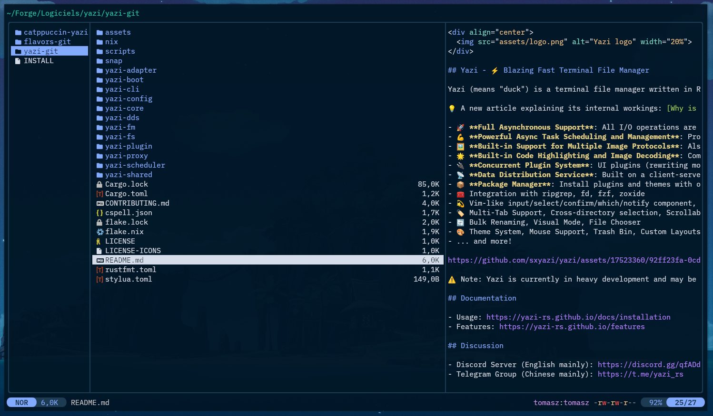

<div align="center">
  
</div>

## nightfly Flavor for [Yazi](https://github.com/sxyazi/yazi)

nightfly.yazi is based on [nightfly](https://github.com/bluz71/vim-nightfly-guicolors)'s colors and [fly16](https://github.com/bluz71/fly16-bat) .tmTheme template. It is usable standalone or with associated terminal themes found in nightfly's [extras section](https://github.com/bluz71/vim-nightfly-colors#extras).

## 👀 Preview



## 🎨 Installation

```bash
ya pack -a tkapias/nightfly.yazi
```

## ⚙️ Usage

Add the these lines to your `theme.toml` configuration file to use it:

```toml
[flavor]
use = "nightfly"
```

## 📜 License

The flavor is MIT-licensed, and the included tmTheme is also MIT-licensed.

Check the [LICENSE](LICENSE) and [LICENSE-tmtheme](LICENSE-tmtheme) file for more details.
